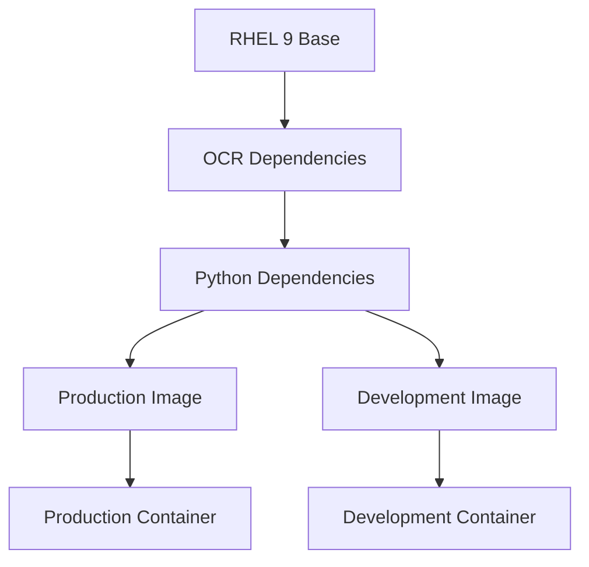

# Docker Deployment Guide - RAG LLM API with RHEL 9

## Overview

This guide provides comprehensive instructions for deploying the RAG LLM API using Docker with Red Hat Enterprise Linux 9 (RHEL 9) as the base image. The deployment includes support for document processing, OCR capabilities, and AI-powered question answering.

## Prerequisites

### System Requirements
- **Docker**: Version 20.10 or higher
- **Docker Compose**: Version 2.0 or higher
- **Memory**: Minimum 2GB RAM (4GB recommended)
- **Storage**: Minimum 10GB free space
- **CPU**: 2 cores minimum (4 cores recommended)

### External Services
- **OpenAI API**: For embeddings and LLM capabilities
- **Qdrant Vector Database**: For vector storage (cloud or self-hosted)

## Quick Start

### 1. Clone the Repository
```bash
git clone <repository-url>
cd rag-llm
```

### 2. Create Environment File
```bash
cp config/env.example .env
```

### 3. Configure Environment Variables
Edit `.env` file with your API keys and endpoints:
```bash
# Required: OpenAI API Key
OPENAI_API_KEY=your_openai_api_key_here

# Required: Qdrant API Key
QDRANT_API_KEY=your_qdrant_api_key_here

# Required: Update Qdrant endpoints
VECTOR_COLLECTION_URL=https://your-cluster-id.us-east-1-0.aws.cloud.qdrant.io:6333/collections/documents
VECTOR_INSERT_API_URL=https://your-cluster-id.us-east-1-0.aws.cloud.qdrant.io:6333/collections/documents/points
VECTOR_SEARCH_API_URL=https://your-cluster-id.us-east-1-0.aws.cloud.qdrant.io:6333/collections/documents/points/search
```

### 4. Create Required Directories
```bash
mkdir -p logs temp certs htmlcov
```

### 5. Build and Run
```bash
# Production deployment
docker-compose up -d

# Development deployment
docker-compose --profile dev up -d
```

## Docker Architecture

### Multi-Stage Build Structure



### Image Layers
1. **Base Layer**: RHEL 9 with system dependencies
2. **OCR Layer**: Tesseract and image processing libraries
3. **Python Layer**: Python dependencies and application setup
4. **Application Layer**: Application code and configuration

## Configuration

### Environment Variables

#### Required Variables
```bash
# API Authentication
OPENAI_API_KEY=your_openai_api_key
QDRANT_API_KEY=your_qdrant_api_key

# External API Endpoints
EMBEDDING_API_URL=https://api.openai.com/v1/embeddings
VECTOR_COLLECTION_URL=https://your-qdrant-cluster/collections/documents
VECTOR_INSERT_API_URL=https://your-qdrant-cluster/collections/documents/points
VECTOR_SEARCH_API_URL=https://your-qdrant-cluster/collections/documents/points/search
LLM_API_URL=https://api.openai.com/v1/chat/completions
```

#### Optional Variables
```bash
# Application Configuration
APP_ENV=production
DEBUG=False
HOST=0.0.0.0
PORT=8000

# AI Model Configuration
EMBEDDING_MODEL=text-embedding-ada-002
LLM_MODEL=gpt-3.5-turbo
VECTOR_SIZE=1536

# OCR Configuration
TESSERACT_LANG=eng
OCR_CONFIDENCE_THRESHOLD=60
```

### Volume Mounts

#### Production Volumes
```yaml
volumes:
  - ./logs:/app/logs          # Application logs
  - ./temp:/app/temp          # Temporary files
  - ./certs:/app/certs        # SSL certificates
  - ./.env:/app/.env:ro       # Environment variables
```

#### Development Volumes
```yaml
volumes:
  - ./app:/app/app            # Source code (live reload)
  - ./config:/app/config      # Configuration files
  - ./scripts:/app/scripts    # Utility scripts
  - ./tests:/app/tests        # Test files
  - ./docs:/app/docs          # Documentation
  - ./logs:/app/logs          # Application logs
  - ./temp:/app/temp          # Temporary files
  - ./certs:/app/certs        # SSL certificates
  - ./htmlcov:/app/htmlcov    # Test coverage reports
  - ./.env:/app/.env:ro       # Environment variables
```

## Deployment Options

### 1. Production Deployment

#### Using Docker Compose
```bash
# Build and start production service
docker-compose up -d

# View logs
docker-compose logs -f rag-llm-api

# Stop service
docker-compose down
```

#### Using Docker Directly
```bash
# Build production image
docker build --target production -t rag-llm-api:latest .

# Run container
docker run -d \
  --name rag-llm-api \
  -p 8000:8000 \
  -v $(pwd)/logs:/app/logs \
  -v $(pwd)/temp:/app/temp \
  -v $(pwd)/certs:/app/certs \
  -v $(pwd)/.env:/app/.env:ro \
  --env-file .env \
  rag-llm-api:latest
```

### 2. Development Deployment

#### Using Docker Compose
```bash
# Build and start development service
docker-compose --profile dev up -d

# View logs
docker-compose logs -f rag-llm-api-dev

# Stop service
docker-compose --profile dev down
```

#### Using Docker Directly
```bash
# Build development image
docker build --target development -t rag-llm-api:dev .

# Run development container
docker run -d \
  --name rag-llm-api-dev \
  -p 8001:8000 \
  -v $(pwd)/app:/app/app \
  -v $(pwd)/config:/app/config \
  -v $(pwd)/scripts:/app/scripts \
  -v $(pwd)/tests:/app/tests \
  -v $(pwd)/docs:/app/docs \
  -v $(pwd)/logs:/app/logs \
  -v $(pwd)/temp:/app/temp \
  -v $(pwd)/certs:/app/certs \
  -v $(pwd)/htmlcov:/app/htmlcov \
  -v $(pwd)/.env:/app/.env:ro \
  --env-file .env \
  rag-llm-api:dev
```

## Health Checks and Monitoring

### Health Check Endpoint
```bash
# Check application health
curl http://localhost:8000/health

# Expected response
{
  "status": "healthy",
  "version": "1.0.0",
  "timestamp": "2024-01-01T12:00:00"
}
```

### Docker Health Checks
```yaml
healthcheck:
  test: ["CMD", "curl", "-f", "http://localhost:8000/health"]
  interval: 30s
  timeout: 10s
  retries: 3
  start_period: 40s
```

### Monitoring Commands
```bash
# Check container status
docker ps

# View container logs
docker logs rag-llm-api

# Monitor resource usage
docker stats rag-llm-api

# Execute commands in container
docker exec -it rag-llm-api bash
```

## Security Considerations

### 1. User Permissions
- Container runs as non-root user (`app`)
- Minimal file permissions
- Read-only environment file mount

### 2. Network Security
- Isolated Docker network
- Configurable CORS settings
- SSL certificate support

### 3. Resource Limits
```yaml
deploy:
  resources:
    limits:
      memory: 2G
      cpus: '1.0'
    reservations:
      memory: 1G
      cpus: '0.5'
```

### 4. Secrets Management
```bash
# Use Docker secrets for sensitive data
echo "your_openai_api_key" | docker secret create openai_api_key -

# Reference in docker-compose.yml
secrets:
  - openai_api_key
```

## Performance Optimization

### 1. Image Size Optimization
- Multi-stage build reduces final image size
- .dockerignore excludes unnecessary files
- Layer caching for faster rebuilds

### 2. Runtime Optimization
- Resource limits prevent memory leaks
- Health checks ensure service availability
- Volume mounts for persistent data

### 3. OCR Performance
- Tesseract optimized for RHEL 9
- Multi-language support
- Configurable confidence thresholds

## Troubleshooting

### Common Issues

#### 1. Container Won't Start
```bash
# Check container logs
docker logs rag-llm-api

# Common causes:
# - Missing environment variables
# - Port conflicts
# - Insufficient resources
```

#### 2. OCR Not Working
```bash
# Check Tesseract installation
docker exec -it rag-llm-api tesseract --version

# Verify language packs
docker exec -it rag-llm-api tesseract --list-langs
```

#### 3. Memory Issues
```bash
# Monitor memory usage
docker stats rag-llm-api

# Increase memory limits in docker-compose.yml
deploy:
  resources:
    limits:
      memory: 4G
```

#### 4. Network Connectivity
```bash
# Test external API connectivity
docker exec -it rag-llm-api curl -I https://api.openai.com

# Check DNS resolution
docker exec -it rag-llm-api nslookup api.openai.com
```

### Debug Commands
```bash
# Enter container shell
docker exec -it rag-llm-api bash

# Check Python environment
python3 -c "import sys; print(sys.path)"

# Verify dependencies
pip3 list

# Test OCR functionality
python3 -c "import pytesseract; print(pytesseract.get_languages())"
```

## Scaling and Production

### 1. Horizontal Scaling
```bash
# Scale to multiple instances
docker-compose up -d --scale rag-llm-api=3
```

### 2. Load Balancing
```yaml
# Add nginx reverse proxy
services:
  nginx:
    image: nginx:alpine
    ports:
      - "80:80"
    volumes:
      - ./nginx.conf:/etc/nginx/nginx.conf
    depends_on:
      - rag-llm-api
```

### 3. Production Considerations
- Use external secrets management
- Implement proper logging aggregation
- Set up monitoring and alerting
- Configure backup strategies
- Use production-grade SSL certificates

## Maintenance

### 1. Updates
```bash
# Update application
git pull
docker-compose build --no-cache
docker-compose up -d

# Update base image
docker pull registry.access.redhat.com/ubi9/ubi:latest
```

### 2. Backup
```bash
# Backup application data
docker run --rm -v rag-llm_logs:/data -v $(pwd):/backup alpine tar czf /backup/logs-backup.tar.gz -C /data .
```

### 3. Cleanup
```bash
# Remove unused containers
docker container prune

# Remove unused images
docker image prune

# Remove unused volumes
docker volume prune
```

## Support and Resources

### Documentation
- [RHEL 9 Documentation](https://access.redhat.com/documentation/en-us/red_hat_enterprise_linux/9)
- [Docker Documentation](https://docs.docker.com/)
- [FastAPI Documentation](https://fastapi.tiangolo.com/)

### Community Support
- [Red Hat Community](https://community.redhat.com/)
- [Docker Community](https://community.docker.com/)
- [FastAPI Community](https://github.com/tiangolo/fastapi/discussions)

### Security Updates
- Monitor RHEL 9 security advisories
- Keep Docker and dependencies updated
- Regularly scan for vulnerabilities

## Conclusion

This Docker deployment guide provides a comprehensive approach to deploying the RAG LLM API using RHEL 9 as the base image. The multi-stage build process ensures optimized images, while the configuration options allow for flexible deployment in various environments.

Key benefits of this deployment:
- ✅ **Enterprise-grade base image** (RHEL 9)
- ✅ **Complete OCR capabilities** with Tesseract
- ✅ **Multi-stage optimization** for smaller images
- ✅ **Production-ready configuration** with health checks
- ✅ **Development-friendly** with live reload
- ✅ **Security-focused** with non-root user and resource limits
- ✅ **Scalable architecture** for production workloads

For additional support or questions, please refer to the project documentation or community resources. 